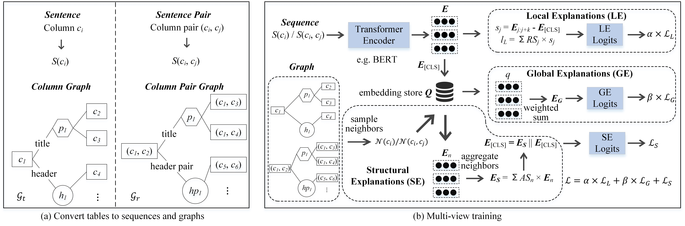

# ExplainTI: Explaining Table Interpretation through Multi-view Explanations

ExplainTI, a framework of explaining table interpretation through multi-view explanations. ExplainTI consists of two phases: tables are converted to sequences and lightweight column graphs firstly, then a pre-trained transformer encoder is fine-tuned to aggregate contextual information and provide multi-view explanations: (i) Local Explanations, are the most relevant phrases (w.r.t. pairwise phrases) in columns (w.r.t. column pairs) for the predictions; (ii) Global Explanations are the most influential samples from training data, which tend to have similar labels to the input sample; (iii) Structural Explanations, we design a relatively small-scale but highly effective method to construct column graphs for tables, which can not only aggregate contextual information but also provide explanations from structural view via graph attention mechanism.

## Framework



## Requirements

- Python 3.7.11
- PyTorch 1.9.0+cu111
- HuggingFace Transformers 4.11.3
- faiss 1.7.1
- scikit-learn 1.0

## Datasets

We used two real world large-scale benchmark datasets from different types for evaluation.

**WikiTable**

The WikiTable dataset are Web tables collected from Wikipedia. We used the same train/valid/test splits as [TURL](https://github.com/sunlab-osu/TURL).

**GitTable**

The GitTable dataset is the first large-scale relational table corpus. We used its subset organism and split it into train, valid, and test using the radio of 8:1:1.

The raw dataset is from [GitTable](https://gittables.github.io/). The code of preprocessing is in `gittable.py` and the preprocessed data is in `data/GitTable`.

## Training with ExplainTI

To train the model and get the explanations with ExplainTI:

```
python train.py [<args>] [-h | --help]
```

The meaning of the flags:

- `--data_name`:  the name of the dataset. e.g. `WikiTable`
- `--path`: the local path of the dataset. e.g. `./data/WikiTable`
- `--column_length`: maximum length of a column after being converted to a sequence. e.g. `64`
- `--n_epoch`: the number of epochs. e.g. `40`
- `--lr`: the learning rate. e.g. `5e-5`
- `--model`: the language model to be fine-tuned. e.g. `bert-base-uncased`
- `--use_large`: whether use large version of the model
- `--le`: the loss weight of the local view. e.g. `0.05`
- `--ge`: the loss weight of the global view. e.g. `0.05`
- `--se`: a flag indicating whether turn on the structural view
- `--window_size`: the number of tokens in a window. e.g. `8`
- `--top_k`: the number of explanations generated for each view. e.g. `10`
- `--num_type`: the number of types. e.g. `255`
- `--num_relation`: the number of relations. e.g. `121`
- `--attention_method`: the aggregate method for graph attention. e.g. `dot`
- `--save_model`: if this flag is on, then save the checkpoint to `{save_path}/{name}.pt`.
- `--save_path`: see `--save_model`. e.g. `./checkpoint`
- `--update_epoch`: indicates how often the global embeddings store is updated. e.g. `5`
